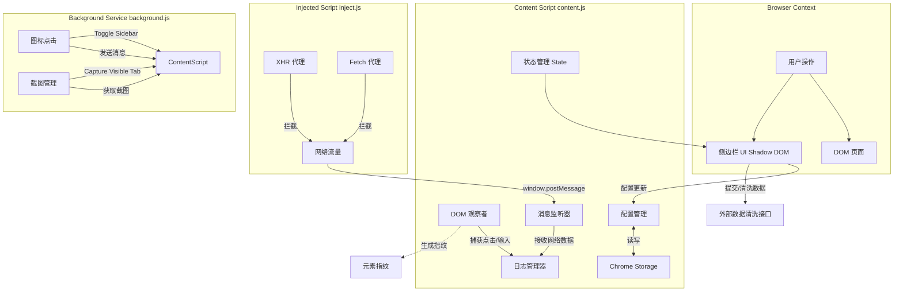

# Chrome 测试操作录制插件 (Chrome Test Recorder)

这是一个 Chrome 扩展程序，旨在测试用例执行期间录制用户操作并捕获网络流量（XHR/Fetch）。它会在页面中注入一个侧边栏来管理测试会话。

## 1. 安装

### 前置要求

* Google Chrome 浏览器。

### 步骤

1. 下载或克隆 (clone) 此代码库。
2. 打开 Chrome 并访问 `chrome://extensions/`。
3. 开启右上角的 **开发者模式 (Developer mode)**。
4. 点击左上角的 **加载已解压的扩展程序 (Load unpacked)**。
5. 选择本项目中的 `src/` 目录。
6. "Test Recorder & Interceptor" 扩展程序应出现在您的列表中。

## 2. 使用指南

### 设置

1. 导航至您想要测试的 Web 应用程序（或在 Chrome 中打开提供的 `test/test_page.html`）。
2. 点击工具栏中的扩展程序图标。页面右侧将出现一个侧边栏。
3. 在侧边栏中，您将看到模拟测试用例列表（例如 "User Login" / 用户登录）。

### 录制

1. 从列表中选择一个测试用例。
2. 点击 **Start Recording**（开始录制）。
3. 在页面上执行操作：
* **点击** 元素（按钮、链接）。
* 在字段中 **输入** 文本。
* 侧边栏将实时记录这些操作。
* 应用程序发起的任何 API 调用（XHR/Fetch）也将记录在侧边栏中。

### 验证与提交

1. 测试步骤完成后，点击 **Stop**（停止）。
2. 将出现验证按钮：
* **Pass**（通过）：如果测试通过，点击此按钮。会话数据将被“上传”（在此演示中会记录到控制台）。
* **Fail**（失败）：如果测试失败，点击此按钮。

3. 如果选择了 **Fail**：
* 会出现一个文本区域用于描述缺陷。
* 点击 **Submit Defect**（提交缺陷）。
* 扩展程序将自动截取当前标签页的屏幕截图并将其包含在报告中。
* 检查 Chrome 开发者工具控制台（`F12` > Console）以查看最终的 JSON 输出。

## 3. 代码结构

* **src/manifest.json**: 扩展配置。定义权限（`activeTab`, `storage`, `scripting`）和脚本。
* **src/background.js**: Service worker（服务工作线程）。处理浏览器事件，如点击扩展图标和捕获屏幕截图。
* **src/content.js**: 注入到网页中的主脚本。
* 管理 **侧边栏 UI**（Shadow DOM）。
* 监听 DOM 事件（点击、更改）以生成 **元素指纹 (element fingerprints)**。
* 接收来自 `inject.js` 的网络日志。
* **src/inject.js**: 注入到页面上下文中的脚本，用于对 `XMLHttpRequest` 和 `window.fetch` 进行“猴子补丁” (monkey-patch/拦截修改)。它拦截网络流量并通过 `window.postMessage` 将详情发送回 `content.js`。
* **test/**: 包含验证脚本和虚拟测试页面。
* `verify_inject.js`: 用于验证网络拦截逻辑的 Node.js 脚本。
* `verify_content_logic.js`: 用于验证元素指纹识别逻辑的 Node.js 脚本。
* `test_page.html`: 用于手动测试扩展程序的简单 HTML 页面。

## 4. 功能详情

### 网络拦截

该扩展程序注入代码以包装 `XMLHttpRequest.prototype.open`、`XMLHttpRequest.prototype.send` 和 `window.fetch`。它捕获：

* 方法 (GET, POST 等)
* URL
* 请求体 (Request Body)
* 响应体 (Response Body)（如果是 JSON）
* 状态码 (Status Code)

### 元素指纹识别 (Element Fingerprinting)

当用户与页面交互时，扩展程序会为目标元素生成唯一的“指纹”，包括：

* 标签名、ID、Class
* 内部文本 (Inner Text)
* 层级结构 (CSS 选择器 / 完整路径)
* 几何位置 (BoundingRect)

这些数据对于可靠的测试回放和分析至关重要。

## 5. 开发人员指南 (Developer Guide)

本节详细介绍了扩展的内部架构、数据流和开发注意事项。

### 架构图

### 关键文件功能详解

#### 1. `src/content.js` (核心逻辑)
这是扩展的大脑，运行在网页的隔离环境中。
- **状态管理 (`state` 对象)**: 维护录制状态、日志队列、当前会话 ID、配置信息（用户名、产品编码、白名单）。
- **Shadow DOM UI**: 使用 Shadow DOM (`#recorder-sidebar-host`) 隔离扩展样式与页面样式。UI 包含以下视图：
    - `configView`: 配置用户名、产品编码和 URL 白名单。
    - `setupView`: 选择测试用例。
    - `recordingView`: 实时显示录制日志。
    - `reviewView`: 录制结束后审查、编辑、批量选择/取消选择日志。
    - `resultView`: 显示最终 JSON 结果及数据清洗功能。
- **配置持久化**: 通过 `loadConfig`/`saveConfig` 与 `chrome.storage.local` 同步。
- **数据清洗 (`cleanData`)**: 将录制数据发送到后端接口进行压缩/优化，请求头包含 `x-test-app-id` 和 `x-user-account`。

#### 2. `src/inject.js` (网络层)
由于 Content Script 无法直接访问页面的 `window.fetch` 或 `XMLHttpRequest` 对象，因此需要注入此脚本。
- **Monkey Patching**: 重写 `window.XMLHttpRequest` 和 `window.fetch`。
- **通信**: 使用 `window.postMessage` 将拦截到的请求信息（URL、Method、Body、Status）发送给 `content.js`。
- **URL 归一化**: 自动将相对 URL 转换为绝对 URL，以便于白名单匹配。

#### 3. `src/background.js` (后台服务)
- **图标交互**: 监听 `chrome.action.onClicked`，向当前标签页发送 `TOGGLE_SIDEBAR` 消息。
- **截图能力**: 提供 `captureVisibleTab` 接口（如果需要扩展截图功能）。

### 开发注意事项

1. **安全性**:
   - 在 UI 中渲染日志时，严禁使用 `innerHTML` 插入用户生成的内容（如输入值），必须使用 `textContent` 或 `innerText` 防止 XSS 攻击。
   - `manifest.json` 使用 V3 版本，限制了远程代码执行。

2. **样式隔离**:
   - 所有 UI 样式都定义在 `content.js` 的 `shadowRoot` 中，避免污染宿主页面。

3. **调试**:
   - UI 和逻辑调试：使用 Chrome DevTools 的 Console 面板（Context 选择 "Test Recorder..."）。
   - 网络拦截调试：查看 Console 中的 `RECORDER_INJECT` 消息。

